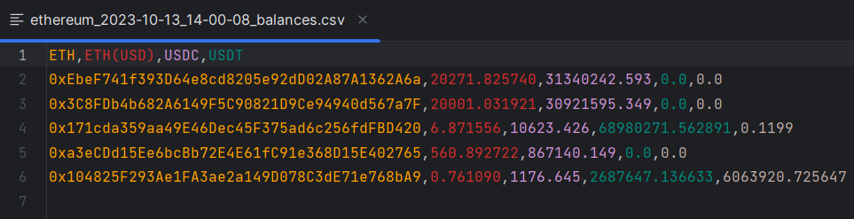

## EVM bulk balance checker
A simple tool to quickly check account balances (including ERC20 token balances and transaction count) on various evm-compatible networks like Ethereum, Arbitrum, Optimism, BSC, Polygon, Fantom, Zksync Era, Base, Scroll, Mantle Network, Kroma, Avalanche and others 

### This is demonstration of EVM bulk balance checker

output:


### Setup
1. Use `pip install -r requirements.txt` to install all required modules.
2. Use `python main.py` to run.

### Usage
1. Define networks RPCs and tokens in the `config.py` file. 
2. Paste addresses you want to check into `accounts.txt` file, each address should be on a new line.
3. Run `main.py` and select desired network


#### To add custom networks
On the example of BASE network in order to check the balances of Eth and USDC.
1. Add another network to the NETWORKS dictionary in the `config.py` file in the following format:
    ```
       "Base": {
        "rpc": "<your https base rpc>",
        "tokens": {
            "ETH": None,
            "USDC": '0x833589fCD6eDb6E08f4c7C32D4f71b54bdA02913'
        }
   ```
2. That's all! you can run the program.

#### Token definition, special fields
- `"ETH": None` - for ETH & ETH(USD) balances,
- `"TX COUNT": None` - for OUT transaction count,
- every other field requires the ticker and address of the erc20 token contract in the following format:
```"LINK": "0x514910771AF9Ca656af840dff83E8264EcF986CA"```.


I recommend using private RPCs.